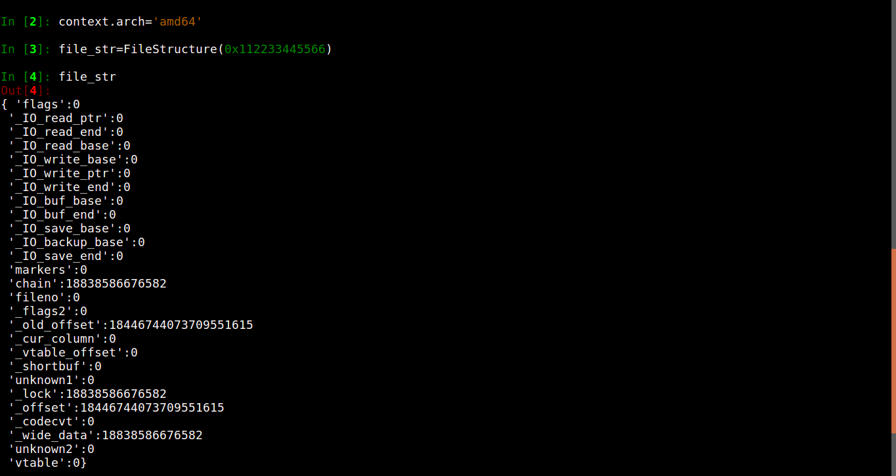

# File Structure Exploitation

This python module is for generating payloads to exploit the FILE structure in C. Can be used in CTF challenges.

## Usage

**FileStructure(null)** - returns an object that can stimulate the FILE structure in C

1. null - an address pointing to null value

**write(addr,size)** - function in FileStructure. Returns payload for writing data from arbitrary address to stdout. Arguments are-

1. addr - the address from where the data is to be written out
2. size - the size of data to be written

**read(addr,size)** - function in FileStructure. Returns payload for reading data to arbitrary address from stdin. Arguments are-

1. addr - the address where the data is to be read
2. size - the size of data to be read

**str(object)** - generate payload from the object of FileStructure.

**struntil(memberVariable)** - generate the payload only upto the specified variable. For eg. struntil('fileno') will generate the payload only uptill fileno. All further variable's are ignored.

**orange(io\_list\_all, vtable)** - returns a payload for [House of Orange](http://4ngelboy.blogspot.com/2016/10/hitcon-ctf-qual-2016-house-of-orange.html) exploit (for libc's < 2.24).

1. io\_list\_all - address of \_IO\_list\_all
2. vtable - address of the fake vtable

**Note -** Set the architecture from `context.arch`. Currently only `i386` and `amd64` architectures have been implemented.

## Examples

Generate the payload with str()

Get the len of the payload

See [PoC](PoC/) for full detailed usage examples

## Credits

Angelboy (@scwuaptx) and his slide's on File Structures - [Play with FILE Structure](http://4ngelboy.blogspot.in/2017/11/play-with-file-structure-yet-another.html)
